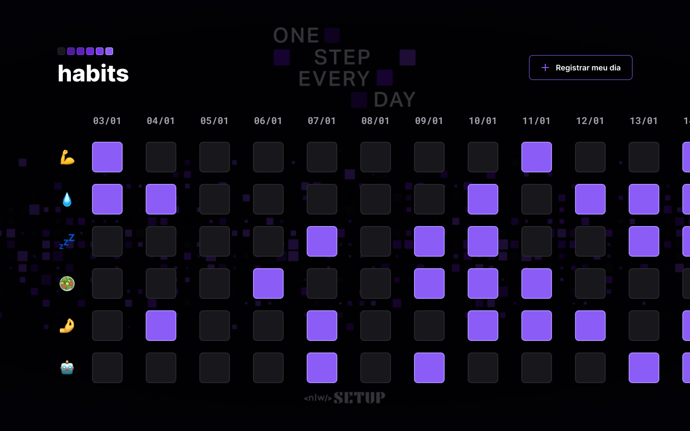

<h1 align="center">NLW Setup - Habits</h1>

 Projeto concluído com a Rocketseat no evento NLW Setup.

 

## Tecnologias
Esse projeto foi desenvolvido com as seguintes tecnologias:
- HTML e CSS
- Javascript
- Git e Github
- Figma

## Projeto
O Habits é um app para rastrear hábitos saudáveis. 
 
No caso adaptei para os meus hábitos pessoais que seriam: Praticar exercícios, tomar água, dormir e acordar em horários pré-determinados, boa alimentação, estudar italiano e estudar programação. 

